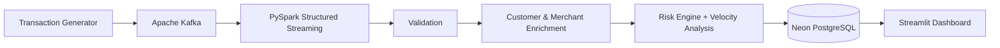

# FinGuard — Real-Time Payment Risk & Fraud Detection Pipeline

[](https://athashrees-fin-guard.streamlit.app/)

> My first project exploring Apache Kafka and PySpark Structured Streaming — built to understand how real-time transaction data moves through a data engineering pipeline.

**[Live Demo](https://athashrees-fin-guard.streamlit.app/)**

---

## About the Project

FinGuard is an **exploration and learning project** where I built a real-time payment risk monitoring pipeline from scratch.

This was my **first time working with Kafka and PySpark**, so the main goal was not to build a production-ready fraud detection system, but to understand how streaming systems work in practice.

I wanted to explore:

- How Kafka handles continuous events
- How PySpark consumes and processes streams
- How streaming data can be joined with reference data
- How window-based processing works
- How processed data can be stored in PostgreSQL
- How a dashboard can be built on top of a streaming pipeline

The project generates simulated payment transactions, processes them through Kafka and PySpark, applies an explainable rule-based risk engine, and stores the results in PostgreSQL for dashboard monitoring.

---

## Architecture



### Current Setup

```text
LOCAL
Transaction Generator
        ↓
Kafka
        ↓
PySpark
        ↓
Risk Processing
        ↓
        ↓
CLOUD
Neon PostgreSQL
        ↓
Streamlit Cloud
        ↓
Public Dashboard


---

## What I Built

- Kafka-based transaction streaming
- PySpark Structured Streaming pipeline
- Transaction validation
- Stream-static joins with customer and merchant data
- Amount anomaly detection
- Merchant risk and blacklist checks
- Location mismatch detection
- 1-minute transaction velocity analysis
- Explainable rule-based risk scoring
- PostgreSQL persistence
- Customer and merchant analytics
- Streamlit investigation dashboard

---

## Risk Engine

Instead of using a Machine Learning model, I implemented a simple **rule-based risk engine** so that every decision could be explained.

| Risk Signal | Score |
|---|---:|
| Blacklisted merchant | +50 |
| HIGH merchant risk | +30 |
| MEDIUM merchant risk | +15 |
| Amount ratio ≥ 5x | +20 |
| Amount ratio ≥ 3x | +10 |
| Location mismatch | +10 |
| ≥ 5 transactions/min | +20 |
| ≥ 3 transactions/min | +10 |

Final classification:

```text
0 – 29   → LOW
30 – 59  → MEDIUM
60+      → HIGH
```

---

## Dashboard

The Streamlit dashboard provides:

**Overview**
- Transaction KPIs
- Risk distribution
- Transaction activity
- Recent high-risk transactions

**Transactions**
- Search and filtering
- Transaction investigation
- Risk-factor breakdown

**Customers**
- Transaction volume
- Average transaction value
- High-risk activity

**Merchants**
- Merchant risk
- Blacklist status
- Transaction volume
- High-risk transactions

---

## Things I Learned

This project was mainly about learning by building.

### Kafka ≠ Database

Kafka acts as the **event streaming layer**, while PostgreSQL is used for persistent storage.

### Stream-Static Joins

I learned how a live transaction stream can be enriched using relatively static customer and merchant reference data.

### Window Processing

I explored event-time windows and transaction velocity to identify unusually frequent activity.

### Explainable Risk Scoring

Building the risk engine with rules made it possible to understand exactly why a transaction received a particular score.

### Streaming Is Different From Pandas

Working with PySpark introduced concepts I hadn't dealt with in normal data analysis:

- Micro-batches
- Watermarks
- Event time
- Windows
- Streaming joins
- JDBC sinks

---

## Problems I Ran Into

This project also involved quite a bit of debugging.

| Problem | What I Learned / Changed |
|---|---|
| Kafka setup on Windows | Learned Kafka configuration and local broker setup |
| Spark + Kafka integration | Learned connector/version compatibility |
| Windows Hadoop/Spark errors | Configured the required Hadoop Windows environment |
| Ambiguous columns after joins | Used aliases and explicit column selection |
| Stream-stream velocity join | Switched to `foreachBatch` after exploring the limitations |
| Duplicate transaction IDs | Replaced random IDs with UUID-based IDs |
| Local PostgreSQL deployment | Moved the database to Neon for public access |

One particularly useful bug was the duplicate transaction ID issue.

I initially generated IDs using random 6-digit numbers. Eventually, two transactions received the same ID and PostgreSQL rejected the insert because of the primary-key constraint.

I changed the generator to UUID-based IDs:

```python
import uuid

transaction_id = f"TXN_{uuid.uuid4().hex[:16]}"
```

That was a small bug, but it taught me an important lesson about designing identifiers for uniqueness in data pipelines.

---

## Why This Architecture?

I considered deploying Kafka, Spark, PostgreSQL, and the dashboard entirely in the cloud.

For an exploration project, that added unnecessary infrastructure and cost.

Instead, I chose a hybrid setup:

**Local**
- Kafka
- PySpark
- Transaction Generator

**Cloud**
- Neon PostgreSQL
- Streamlit Community Cloud

This gives me a publicly accessible dashboard while allowing me to experiment with the streaming pipeline locally.

---

## Tech Stack

| Technology | Purpose |
|---|---|
| Python | Core development |
| Apache Kafka | Event streaming |
| PySpark | Stream processing |
| PostgreSQL / Neon | Data storage |
| Streamlit | Dashboard |
| Pandas | Reference data |
| Plotly | Visualization |

---

## Project Structure

```text
FinGuard/
├── .streamlit/
├── dashboard/
├── data/
├── data_generator.py
├── transaction_generator.py
├── spark_kafka_test.py
├── spark_test.py
├── velocity_test.py
├── requirements.txt
└── README.md
```

---

## Current Limitations

This is an **exploration/learning project**, not a production fraud detection platform.

- Kafka and PySpark currently run locally.
- Transactions are simulated.
- Risk detection is rule-based.
- There is no trained fraud ML model.
- Velocity processing is not yet implemented as a production-grade persistent state system.
- Production monitoring and alerting are not included.

---

## Future Scope

If I continue developing FinGuard, I would explore:

- Persistent stateful velocity detection
- ML-based fraud classification
- Real-time fraud alerts
- Dockerized deployment
- Managed Kafka
- Cloud-based Spark processing
- Pipeline monitoring and observability
- Dead-letter queues and retry mechanisms

---

## Key Takeaway

FinGuard started as a simple goal:

> **Learn Kafka and PySpark by actually building something.**

It became an opportunity to understand how different components of a data engineering system fit together:

```text
Events
  ↓
Kafka
  ↓
Spark
  ↓
Validation
  ↓
Enrichment
  ↓
Feature Engineering
  ↓
Risk Processing
  ↓
PostgreSQL
  ↓
Dashboard
```

The most valuable part of the project wasn't just learning two new technologies. It was learning how to **debug, make architectural trade-offs, and connect individual technologies into a working data pipeline.**

---

## Live Demo

**[FinGuard Dashboard](https://athashrees-fin-guard.streamlit.app/)**

---

## Author

**Athashree Badokar**

B.Tech — Data Science
```
