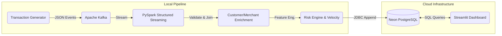

# FinGuard — Real-Time Payment Risk & Fraud Detection Pipeline

FinGuard is a robust, real-time data engineering pipeline designed to monitor financial transactions and detect fraudulent activity on the fly. It leverages Apache Kafka and PySpark Structured Streaming to process high-velocity payment events, apply rule-based risk scoring, and persist enriched results into a cloud PostgreSQL database for live dashboard monitoring.

[Live Demo](https://athashrees-fin-guard.streamlit.app/)

## Overview

Modern payment systems require ultra-low latency detection of anomalous behavior. FinGuard ingests a continuous stream of transactions and performs instantaneous stream-static joins against customer and merchant reference data. 

Rather than a black-box machine learning model, FinGuard relies on a transparent, **rule-based risk engine** to calculate anomaly scores based on transaction velocity, amount ratios, geolocation mismatches, and entity blacklisting. The processed alerts are written to a cloud-hosted Neon PostgreSQL database, where a Streamlit operational dashboard allows analysts to investigate flagged transactions in real-time.

## Architecture



## Key Features

- **Kafka-based transaction streaming**: Ingestion of raw payment events.
- **PySpark Structured Streaming**: Micro-batch processing of the Kafka topic.
- **Data validation**: Enforcing strict schema and field requirements.
- **Stream-static joins**: Enriching the stream with historical customer and merchant data.
- **Amount anomaly detection**: Comparing transaction values against historical averages.
- **Merchant risk detection**: Flagging known high/medium risk vendors.
- **Blacklist detection**: Immediate escalation for blacklisted entities.
- **Location mismatch detection**: Identifying when transaction locations differ from customer residency.
- **Transaction velocity analysis**: Aggregating 1-minute window transaction counts per customer.
- **Explainable risk scoring**: A fully transparent additive scoring system.
- **PostgreSQL persistence**: Storing final, enriched records for downstream analysis.
- **Transaction investigation**: Deep-dive operational UI for analysts to review flags.
- **Customer & Merchant analytics**: Aggregated behavioral metrics.
- **Streamlit dashboard**: A live, auto-refreshing public operations terminal.

## Risk Scoring

FinGuard utilizes a transparent, rule-based risk scoring engine. It calculates a `base_risk_score` and a `velocity_risk` to arrive at a `final_risk_score`.

**Scoring Factors:**
- **Blacklisted merchant**: +50
- **Merchant risk (HIGH)**: +30
- **Merchant risk (MEDIUM)**: +15
- **Amount ratio ≥ 5x (Anomaly)**: +20
- **Amount ratio ≥ 3x (Anomaly)**: +10
- **Location mismatch**: +10

**Velocity Risk (Rolling 1-minute window):**
- **≥ 5 transactions/min**: +20
- **≥ 3 transactions/min**: +10

**Final Classification (`final_risk_level`):**
- **HIGH**: Score ≥ 60
- **MEDIUM**: Score ≥ 30
- **LOW**: Score < 30

*(Note: This is an explicitly rule-based operational engine, not a trained ML model.)*

## Data Flow

1. The `transaction_generator.py` script continuously creates and serializes JSON transaction events.
2. Apache Kafka publishes these events to the local `payment_transactions` topic.
3. PySpark consumes the streaming data, casting JSON into a typed schema.
4. Transactions are strictly validated (null checks, enum checks, positive amounts).
5. Customer and merchant reference CSV datasets are joined into the micro-batch stream.
6. Risk features (such as `amount_ratio`) are engineered on the fly.
7. A time-window aggregation evaluates the current transaction velocity for each customer.
8. The final risk score and level are calculated based on the combined factors.
9. Results are appended to the `transactions` table in the Neon PostgreSQL cloud database via JDBC.
10. The deployed Streamlit dashboard queries PostgreSQL to provide an interactive investigation interface.

## Dashboard

The Streamlit operational dashboard is divided into four main sections:

### Overview
Displays core KPIs (Total Transactions, High Risk count, Total Value, Average Value). Features interactive Plotly charts showing the exact Risk Distribution and Transactions per Minute. Showcases a quick-access feed of recently flagged HIGH risk transactions.

### Transactions
A detailed transaction explorer allowing analysts to filter by Risk Level, Transaction Type, and search by ID. Includes a **Transaction Investigation** module that completely breaks down the exact mathematical factors contributing to a specific transaction's risk score.

### Customers
Aggregated analytics showcasing total volume, average transaction size, and high-risk flags associated with specific customer segments.

### Merchants
Aggregated analytics breaking down risk exposure by merchant category and identifying heavily blacklisted entities.

## Tech Stack

| Technology | Purpose |
|---|---|
| **Python** | Core programming language for generators and dashboard |
| **Apache Kafka** | High-throughput distributed message broker for raw events |
| **PySpark** | Distributed data processing and structured streaming |
| **PostgreSQL / Neon** | Cloud-native relational database for permanent analytical storage |
| **Streamlit** | Rapid development of the interactive Python-based web dashboard |
| **Plotly & Pandas** | Data manipulation and advanced charting |

## Project Structure

```text
FinGuard/
├── .streamlit/
│   └── config.toml             # Streamlit Cloud theme settings
├── dashboard/
│   ├── __init__.py             # Module declaration
│   ├── app.py                  # Main Streamlit dashboard entrypoint
│   ├── components.py           # Shared UI components and formatting
│   ├── db.py                   # PostgreSQL connection pooling
│   ├── queries.py              # Parameterized SQL statements
│   └── styles.py               # Custom CSS styling
├── data/
│   ├── customers.csv           # Static customer reference data
│   └── merchants.csv           # Static merchant reference data
├── .env.example                # Template for database credentials
├── data_generator.py           # Script to generate static reference CSVs
├── requirements.txt            # Streamlit Cloud deployment dependencies
├── spark_kafka_test.py         # Main PySpark streaming pipeline
├── spark_test.py               # Spark installation validation script
├── transaction_generator.py    # Continuous Kafka payment event producer
└── velocity_test.py            # Local velocity logic testing script
```
